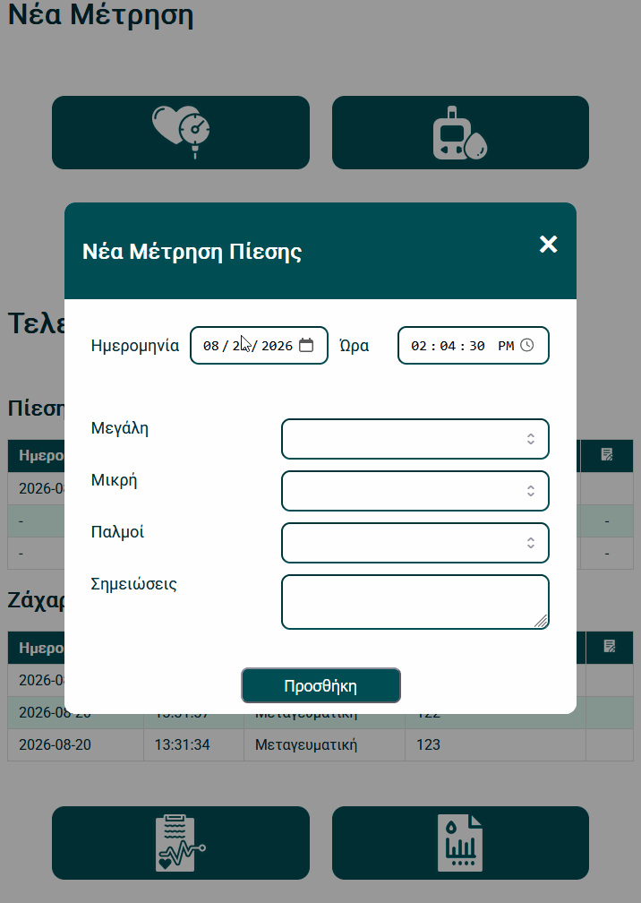

# Mirareru

A simple app to keep track of your blood pressure and glucose levels

## Description

If you need to keep up with your blood pressure and / or glucose levels and want something other than having an excel document around, this app might be useful. I took extra care to make it mobile friendly so one can just take out their phone and enter the measurement then and there. 



### Instructions

1. Install [node.js](https://nodejs.org/en/download)

2. Run npm install to get all required packages. You should end up with the following:
    ```
        better-sqlite3
        cors
        dotenv
        express  
        pdfkit  
    ```

3. Copy the .env.example to .env and set the  database location (if you wish to change it), the port you want the express server to listen to and the API Token you got from TMDB. Please note, that you might have to create the directory if it does not exist, otherwise you will get an error at the next step. 

4. Start the server
    ```
        node server.js
    ```

5. Point your browser to localhost:PORT or to [server.ip]:port

### Disclaimer

This app holds medical data. I am in no way responsible for where this data will end up. Please use at your own risk. 

This project was made for my own personal use and was never intended for something more than that. Therefore, no energy was spent on assets. All icons (including the favicon) were found on [Magnific](https://www.magnific.com/app) and are all under their free licence. 

Important: Please be very careful if you plan to expose this app to the internet. I have not taken any particular steps to harden the security, due to my lack of knowledge of doing so. 

The whole PDF export function was heavily created with the use of AI. I wanted to get it out of the window without having to spend too much time learning pdfkit. If it proves something that I will be needing in the future, I will do my best to not rely on AI. 

### Roadmap

- [X] Make layout mobile friendly (looks ok on my mobile, far from proper responsive design)
- [ ] Refactor code (right now it's a mess)
- [ ] Add multilanguage support (currently only in Greek)
- [ ] Add the option to render charts of measurements

I would welcome any suggestions, critique etc. You can reach me on Reddit [/u/clampropoulos](https://www.reddit.com/user/clampropoulos)
